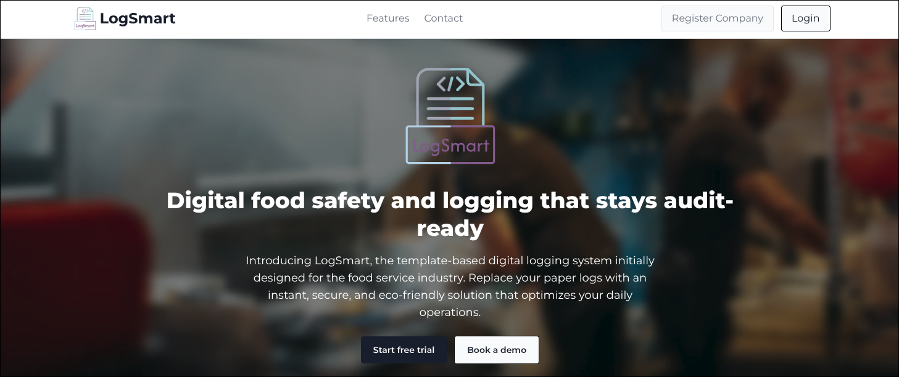
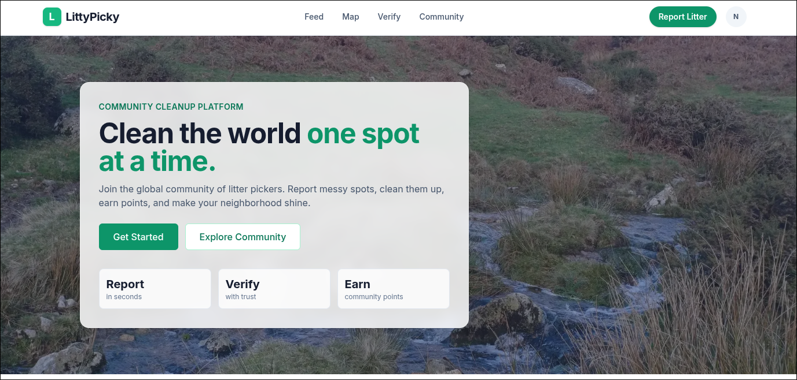

  

  <a href="https://nullstring.one">Website</a> •
  <a href="https://www.linkedin.com/in/danielrkern/">LinkedIn</a> •
  <a href="https://github.com/NullString1">GitHub</a>

---

## About Me

I'm a **Cyber Security student** at **Plymouth University** with a passion for **reverse engineering**, **low-level systems**, and **security research**. Active NixOS maintainer

---

## University Projects

### [LogSmart](https://logsmart.app) [git](https://github.com/Plymouth-University/comp2003-2025-2026-group-2)
**Digital Food Safety & Compliance Platform**

A template-based digital logging system for the food service industry. Features AI-powered template generation, real-time dashboards, and audit-ready digital records.

`Svelte` `Bun` `Rust` `Axum` `Docker` `Oracle Cloud` `GitHub Actions`

---

### [LittyPicky](https://littypicky.nullstring.one) [git](https://github.com/nullstring1/littypicky)
**Community Cleanup Platform**

A gamified platform for reporting and cleaning up litter. Users report messy spots, clean them up, and earn points while making their neighborhoods shine.

`Svelte` `Bun` `Rust` `Axum` `Docker` `Oracle Cloud` `GitHub Actions`

---

## Personal Projects

| Project | Description | Tech |
|---------|-------------|------|
| **[NullOS](https://github.com/NullString1/NullOS)** | Easy NixOS setup aimed for developers with a focus on GUI tools | `Nix` |
| **[VWCDC](https://github.com/NullString1/VWCDC)** | VW CD Changer Emulator - ESP32-based emulator for VW radios enabling AUX input | `C++` `Embedded` |
| **[re300](https://github.com/NullString1/re300)** | TP-Link RE300 Reverse Engineering - Config decryption and custom firmware with OpenWRT | `Rust` `Reverse Engineering` |
| **[filterfs](https://github.com/NullString1/filterfs)** | FUSE filesystem with file extension filtering capabilities | `Rust` `Filesystem` |
| **[btsnoop-parser](https://github.com/NullString1/btsnoop-parser)** | Rust library for parsing btsnoop logs - Bluetooth LE reverse engineering tool | `Rust` `Bluetooth` |

---

## Tech Stack

  
  
  
  
  
  
  
  

  
  
  
  
  
  

---

## GitHub Stats

  

  

---

## Get In Touch

- [LinkedIn](https://www.linkedin.com/in/danielrkern/)
- [Website](https://nullstring.one)
- [GitHub](https://github.com/NullString1)

---

  

